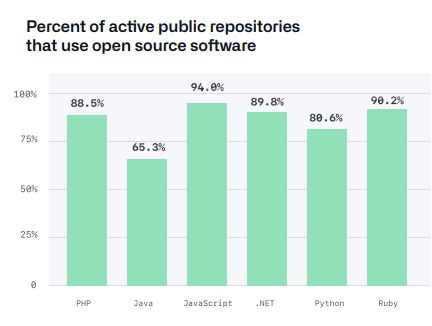
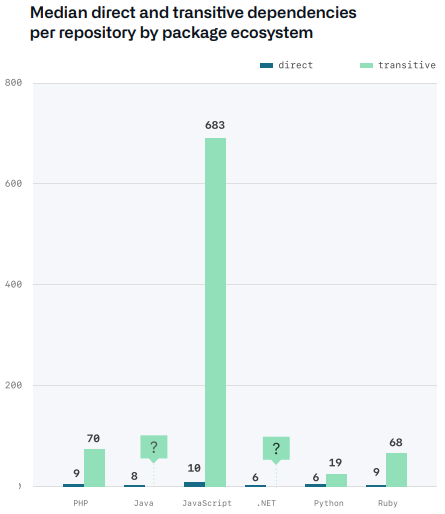
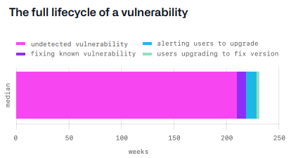
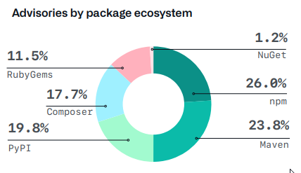

# Best practices for a secure supply chain

Open Source is everywhere. It is in many proprietary codebases and community projects. For organizations and individuals, the question today is not whether you are or are not using open-source code, but what open-source code you are using, and how much.

If you're not aware of what is in your software supply chain, an upstream vulnerability in one of your dependencies can be fatal, making you, and your customers, vulnerable to a potential compromise. In this document, we will dive deeper into what the term “software supply chain” means, why it matters, and how you can help secure your project’s supply chain with best practices.

## Dependencies 

The term software supply chain is used to refer to everything that goes into your software and where it comes from. It is the dependencies and properties of your dependencies that your software supply chain depends on. A dependency is what your software needs to run. It can be code, binaries, or other components, and where they come from, such as a repository or package manager.

It includes who wrote the code, when it was contributed, how it was reviewed for security issues, known vulnerabilities, supported versions, license information, and just about anything that touches it at any point of the process.

Your supply chain also encompasses other parts of your stack beyond a single application, such as your build and packaging scripts or the software that runs the infrastructure your application relies on.

## Vulnerabilities

Today, software dependencies are pervasive. It is quite common for your projects to use hundreds of open-source dependencies for functionality that you did not have to write yourself. This may mean that most of your application consists of code that you did not author. 

Possible vulnerabilities in your third-party or open-source dependencies, are presumably dependencies you cannot control as tightly as the code you write, which can create potential security risks in your supply chain.

If one of these dependencies has a vulnerability, the chances are you have a vulnerability as well. This can be scary as one of your dependencies may change without you even knowing. Even if a vulnerability exists in a dependency today, but is not exploitable, it can be exploitable in the future. 

Being able to leverage the work of thousands of open-source developers and library authors means that thousands of strangers can effectively contribute directly to your production code. Your product, through your software supply chain, is affected by unpatched vulnerabilities, innocent mistakes, or even malicious attacks against dependencies.

## Supply chain compromises

The traditional definition of a supply chain comes from manufacturing; it is the chain of processes required to make and supply something. It includes planning, supply of materials, manufacturing, and retail. A software supply chain is similar, except instead of materials, it is code. Instead of manufacturing, it is development. Instead of digging ore from the ground, code is sourced from suppliers, commercial or open source, and, in general, the open-source code comes from repositories. Adding code from a repository means your product takes a dependency on that code.

One example of a software supply chain attack occurs when malicious code is purposefully added to a dependency, using the supply chain of that dependency to distribute the code to its victims. Supply chain attacks are real. There are many methods to attack a supply chain, from directly inserting malicious code as a new contributor, to taking over a contributor’s account without others noticing, or even compromising a signing key to distribute software that is not officially part of the dependency.

A software supply chain attack is in and of itself rarely the end goal, rather it is the beginning of an opportunity for an attacker to insert malware or provide a backdoor for future access.

## Unpatched software

The use of open source today is significant and is not expected to slow down anytime soon. Given that we are not going to stop using open-source software, the threat to supply chain security is unpatched software. Knowing that, how can you address the risk that a dependency of your project has a vulnerability?

- **Knowing what is in your environment.** This requires discovering your dependencies and any transitive dependencies to understand the risks of those dependencies such as vulnerabilities or licensing restrictions.
- **Manage your dependencies.** When a new security vulnerability is discovered, you must determine whether you are impacted, and if so, update to the latest version and security patch available. This is especially important to review changes that introduce new dependencies or regularly auditing older dependencies.
- **Monitor your supply chain.** This is by auditing the controls you have in place to manage your dependencies. This will help you enforce more restrictive conditions to be met for your dependencies.

We will cover various tools and techniques that NuGet and GitHub provides, which you can use today to address potential risks inside your project. 

## Knowing what is in your environment

### NuGet dependency graph

You can view your NuGet dependencies in your project by looking directly at the respective project file.

This is typically found in one of two places:

-	[`packages.config`](../reference/packages-config.md) – Located in the project root.
-	[`<PackageReference>`](../consume-packages/package-references-in-project-files.md) – Located in the project file. 

Depending on what method you use to manage your NuGet dependencies, you can also use Visual Studio to view your dependencies directly in [Solution Explorer](/visualstudio/ide/solutions-and-projects-in-visual-studio?view=vs-2019#solution-explorer) or [NuGet Package Manager](../consume-packages/install-use-packages-visual-studio.md).

For CLI environments, you can use the [`dotnet list package`](/dotnet/core/tools/dotnet-list-package) command to list out your project or solution’s dependencies. 

For more information on managing NuGet dependencies, [see the following documentation](../consume-packages/overview-and-workflow.md).

### GitHub dependency graph 

You can use GitHub’s dependency graph to see the packages your project depends on and the repositories that depend on it. This can help you see any vulnerabilities detected in its dependencies.

For more information on GitHub repository dependencies, [see the following documentation](https://github.co/dependency-graph).

### Dependency versions

To ensure a secure supply chain of dependencies, you will want to ensure that all your dependencies are regularly updated to the latest stable version. Your dependencies can include code you depend on, binaries you consume, tooling you use, and other components. This can include:

-	[Visual Studio](https://visualstudio.microsoft.com/downloads/)
-	[.NET SDK & Runtime](https://dotnet.microsoft.com/download)
-	[NuGet](https://www.nuget.org/downloads)
-	[NuGet packages](../consume-packages/reinstalling-and-updating-packages.md)

## Manage your dependencies

### NuGet deprecated and vulnerable dependencies

You can use the [dotnet CLI](/dotnet/core/tools/dotnet-list-package) to list any known deprecated or vulnerable dependencies you may have inside your project or solution. You can use the command `dotnet list package --deprecated` or `dotnet list package --vulnerable` to provide you a list of any known deprecations or vulnerabilities.

### GitHub vulnerable dependencies

If your project is hosted on GitHub, you can leverage [GitHub Security](https://docs.github.com/en/free-pro-team@latest/github/finding-security-vulnerabilities-and-errors-in-your-code/automatically-scanning-your-code-for-vulnerabilities-and-errors) to find security vulnerabilities and errors in your project and Dependabot will fix them by opening up a pull request against your codebase. 

Catching vulnerable dependencies before they are introduced is one goal of the [“Shift Left”](https://en.wikipedia.org/wiki/Shift-left_testing) movement. Being able to have information about your dependencies such as their license, transitive dependencies, and the age of dependencies helps you do just that.

For more information about Dependabot alerts & security updates, [see the following documentation](https://docs.github.com/en/github/managing-security-vulnerabilities/about-alerts-for-vulnerable-dependencies).

### NuGet feeds

Packages can come from different feeds. To ensure you are secure, knowing what feed your packages are coming from is a best practice. One such best practice is the use of a single feed. You can accomplish this by using multiple upstream source feeds to bring your packages into a single feed.

For more information about single NuGet feeds, [see the following documentation](/azure/devops/artifacts/concepts/upstream-sources?view=azure-devops).

### Client trust policies

There are policies that you can opt-into in which you require the packages you use to be signed. This allows you to trust a package author, as long as it is author signed, or trust a package if it is owned by a specific user or account that is repository signed by NuGet.org.

To configure client trust policies, [see the following documentation](../consume-packages/installing-signed-packages.md).

### Lock files

Lock files store the hash of your package’s content. If the content hash of a package you want to install matches with the lock file, it will ensure package repeatability.

To enable lock files, [see the following documentation](../consume-packages/package-references-in-project-files#locking-dependencies).

## Monitor your supply chain

### Publish to NuGet.org

NuGet.org serves as a central repository to over 200,000 unique packages. Whenever you publish a package, NuGet.org will go through numerous validations and indexing that can benefit you in the long term. These can include scanning the package for viruses, [providing a repository signature](../reference/signed-packages-reference.md) on the package, and even protecting your package ID so only you can push updates to it.

To learn more about the benefits of publishing on NuGet.org, see [Package validation and indexing](../nuget-org/publish-a-package.md#package-validation-and-indexing).

### GitHub secret scanning

GitHub scans repositories for NuGet API keys to prevent fraudulent uses of secrets that were accidentally committed. 

To learn more about secret scanning, see [About secret scanning](https://docs.github.com/en/github/administering-a-repository/about-secret-scanning).

### Author Package Signing

[Author signing](../reference/signed-packages-reference.md) allows a package author to stamp their identity on a package and for a consumer to verify it came from you. This protects you against content tampering and serves as a single source of truth about the origin of the package and the package authenticity. 

To author sign a package, see [Sign a package](../create-packages/sign-a-package.md).

### Two-Factor Authentication (2FA)

Enabling two-factor authentication (2FA) can add an extra layer of security when [logging into your GitHub account](https://docs.github.com/en/github/authenticating-to-github/securing-your-account-with-two-factor-authentication-2fa) or the [NuGet.org public package repository](../nuget-org/individual-accounts.md#enable-two-factor-authentication-2fa). It is recommended that you enable two-factor authentication to protect your account.

### Package ID prefix reservation 

To protect the identity of your packages, you can reserve a package ID prefix to associate a matching owner if your package ID prefix properly falls under the [specified criteria](../nuget-org/id-prefix-reservation.md#id-prefix-reservation-criteria).

To learn about reserving ID prefixes, see [Package ID prefix reservation](../nuget-org/id-prefix-reservation.md).

### Deprecating and unlisting a vulnerable package

To protect the .NET package ecosystem when you are aware of a vulnerability in a package you have authored, do your best to deprecate and unlist the package so it is hidden from users searching for packages. If you are consuming a package that is deprecated and unlisted, you should avoid using the package.

To learn how to deprecate and unlist a package, see the following documentation on [deprecating](../nuget-org/deprecate-packages.md) and [unlisting packages](../nuget-org/policies/deleting-packages.md#unlisting-a-package).

## Summary

Your software supply chain is anything that goes into or affects your code. Even though supply chain compromises are real and growing in popularity, they are still rare; so the most important thing you can do is protect your supply chain by **being aware of your dependencies, managing your dependencies** and **monitoring your supply chain.**

You learned about various methods that NuGet and [GitHub](/learn/modules/maintain-secure-repository-github/) provide that are available to you today to be more effective in viewing, managing, and monitoring your supply chain.

To secure your package feeds, see [3 Ways to Mitigate Risk When Using Private Package Feeds](https://azure.microsoft.com/en-us/resources/3-ways-to-mitigate-risk-using-private-package-feeds/).

For more information about securing the world's software, see [The State of the Octoverse 2020 Security Report](https://octoverse.github.com/static/github-octoverse-2020-security-report.pdf).
